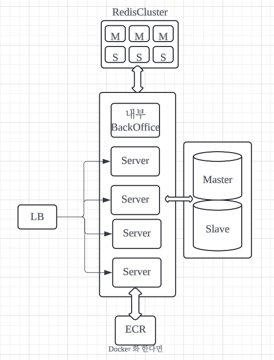

앞에 로드 밸런서가 있고 back-office 는 내부에 있으며\
로드 밸런서를 통해서 들어오는 API 는 freePoint 에 관련된 API 만 들어옵니다.\
(미구현) Spring-security 를 이용하여 back-office api 는 인가를 통하여 외부 API 가\
내부 backOffice 의 API 를 실행할 수 없도록 합니다.

Redis 는 외부에 있으며 cluster 형태로 되어있습니다.\
(미구현) 이미지 빌드를 하게되면 ECR 에 이미지를 올려두고 서버가 올라올 때 해당 이미지를 실행할 수₩ 
있도록 합니다.\

(미구현)DB는 Mysql 을 생각중이며, CQRS 를 하기 위한 master slave 를 구분하여 설계합니다. 
